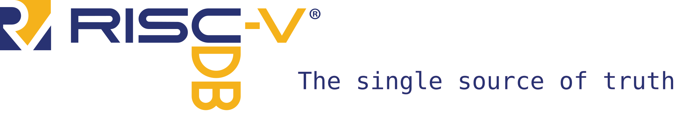

image::https://api.reuse.software/badge/github.com/riscv/riscv-unified-db[REUSE status, link="https://api.reuse.software/info/github.com/riscv/riscv-unified-db"]

[WARNING]
----
This project is under rapid development. Expect schemas and APIs to change.

The data in the `spec` directory is also a work in progress and may be incorrect.

That said, the following data has been validated against third-party sources:

* Instruction encodings are validated to match riscv-opcodes
* Instruction names and assembly formats are validated against LLVM.
----

== Quick links

* https://riscv.github.io/riscv-unified-db/index.html[The latest UDB-generated **UNOFFICIAL** RISC-V specifications].
* UDB Documentation
** xref:doc/schemas.adoc[Schema documentation]
** xref:doc/idl.adoc[ISA Description Language (IDL)]
** xref:doc/ruby.adoc[Ruby database interface]
* How-to/recipes
** xref:CONTRIBUTING.adoc[Contribution guidelines]
** xref:doc/data-templates.adoc[Data templates]
** xref:doc/riscv-opcodes-migration.adoc[`riscv-opcodes` migration]

== Overview

The goal of the RISC-V Unified Database (UnifiedDB/UDB) is to hold *all* the information needed to describe RISC-V,
including a list of extensions, instruction specifications, CSR specifications, and documentation prose. The vision is that anything one would need for RISC-V can be generated from the information in this repository.

In addition to storing the data, UnifiedDB also provides many tools that use the data to generate
artifacts such as specification documents, toolchain inputs, and simulators.

UnifiedDB is an open-source, worldwide project.
Contributors do not need to be members of https://riscv.org[RISC-V International (RVI)],
though maintainers discuss strategic direction and coordinate with the RISC-V standard through the
https://lf-riscv.atlassian.net/wiki/x/iwCsCw?atlOrigin=eyJpIjoiYzU3N2ZiNDViMGRkNGE3ODg0ODVlOWU5YzgzYWM2ODMiLCJwIjoiYyJ9[UnifiedDB Special Interest Group (UDB SIG)] at RVI.

== Repository structure

The following directories contain information relevant to most users of UnifiedDB

* `spec`: Holds all data specification files, along with their schemas
* `spec/std`: The RISC-V standard
* `spec/custom`: Non-standard RISC-V extensions
* `spec/schemas`: Data schemas for the specification content
* `cfgs`: Configurations used by backends to customize generated outputs

Additionally, developers will be interested in the following:

* `backends`: Tools to generate artifacts (documents, simulators, etc.) from UDB data
* `tools/ruby-gems`: Ruby gem libraries for interacting with UDB / IDL
* `bin`: Wrapper scripts to run commands in the development environment

== Getting Started

=== Prerequisites

UnifiedDB tools can run natively on your machine using https://mise.jdx.dev[mise].
or inside a container using Docker or Podman.

=== Native Setup (mise)

https://mise.jdx.dev[mise] manages all tool versions (Ruby, Python, Node.js, CMake, etc.) needed
to work on UnifiedDB.

. Install mise: https://mise.jdx.dev/getting-started.html
. It is *strongly* recommended to activate mise in your shell profile (`.bashrc`, `.zshrc`, etc.)
  so that mise-managed tools are available in your `PATH`:
+
[source,bash]
----
echo 'eval "$(mise activate bash)"' >> ~/.bashrc  # or ~/.zshrc for zsh
----
+
See the https://mise.jdx.dev/getting-started.html#activate-mise[mise activation docs] for other shells.
. From the repo root, install all tools:
+
[source,bash]
----
mise install
----
. Install git hooks (pre-commit linting via `prek`; auto-runs `mise install` on merge/checkout when `.mise.toml` changes):
+
[source,bash]
----
bin/install_hooks
----
. Verify your environment:
+
[source,bash]
----
bin/doctor
----

=== Tasks

[source,bash]
----
./bin/regress -h             # get help on running regression tests

./bin/generate -h            # get help on generating content from UDB

./bin/chore -h               # get help on running repository development chores
----
